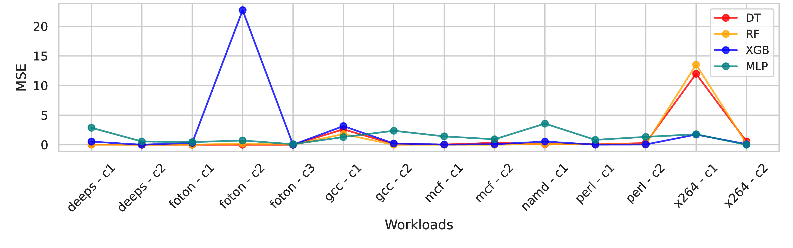

# Minimal Counters, Maximum Insight: Simplifying System Performance with HPC Clusters for Optimized Monitoring

- PerformanceCounters_List.csv: List of all performance counters
- performance_counter_correlations_score.csv: Pearson Correlation scores of HPCs
- Dendogram.png: Dendogram formed using Ward's Method

### Mean Squared Error (Full Prediction)

### Mean Squared Error (Initial run-time Prediction)

### Bartlett Lake SPEC Predictions with Standard Deviation
Bartlett Lake configuration specifications:
#Big-cores = 12
#Small-cores = 0
Cache Size = [18M,24M,30M]
Frequency = [1.8GHz, 3.4GHz]
Hyperthreading = [Enable, Disable]

